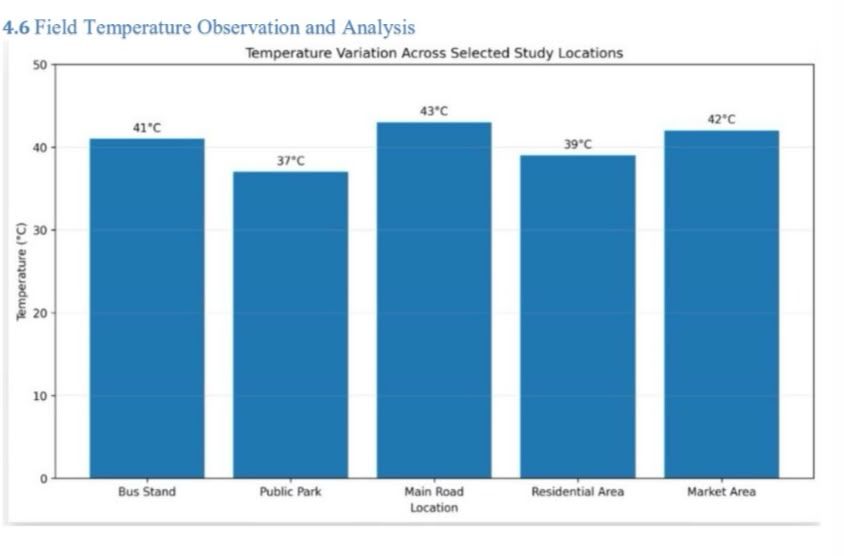
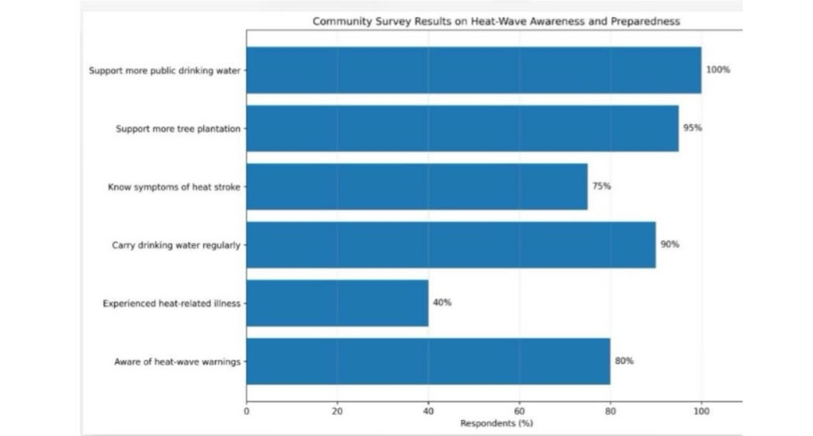

# 🌡️ Heat Wave Disaster Management – Hyderabad

> A field-based study of urban heat exposure, community preparedness, vulnerability, and disaster-management strategies in Hyderabad, India.

## 📖 Overview

Extreme heat is becoming an increasingly important urban disaster as cities experience rapid urbanization, dense construction, loss of vegetation, and rising temperatures.

This project studies **heat-wave risk and disaster management in Hyderabad, Telangana**, using field observations, temperature measurements, community responses, and an analysis of preparedness and mitigation strategies.

Rather than treating a heat wave only as a weather event, the project examines how the **built environment, vegetation, infrastructure, public awareness, and access to resources** influence people's exposure and vulnerability to extreme heat.

---

## 🎯 Project Objectives

The main objectives of this study were to:

- Examine heat-wave conditions and their impact in an urban environment.
- Compare heat exposure across different locations.
- Study the influence of vegetation, shade, roads, traffic, and built-up surfaces.
- Assess community awareness and preparedness for extreme heat.
- Identify factors contributing to heat vulnerability.
- Study disaster preparedness, response, and recovery measures.
- Explore technology-based approaches for heat-wave monitoring and mitigation.
- Suggest practical measures for improving urban heat resilience.

---

## 📍 Study Area

**Hyderabad, Telangana, India**

The field study considered locations representing different urban environments, including areas with vegetation and shade as well as exposed roads and built-up surroundings.

This allowed local conditions to be compared and provided a practical view of how urban environments can influence heat exposure.

---

## 🔬 Methodology

The project followed a field-oriented approach combining environmental observation and community-level assessment.

### 1. Field Observation

Different locations were observed for factors such as:

- Vegetation and tree cover
- Availability of shade
- Road and concrete surfaces
- Traffic exposure
- Built-up surroundings
- Access to public facilities

### 2. Temperature Assessment

Temperature observations from different environments were compared to identify variation in heat exposure across the study area.

### 3. Community Survey

A community survey was used to understand:

- Awareness of heat-wave risks
- Protective measures adopted during extreme heat
- Perceived impacts of high temperatures
- Preparedness and access to basic resources

### 4. Disaster Management Assessment

The study considered different stages of heat-wave management:

**Prevention → Preparedness → Response → Recovery**

### 5. Technology Assessment

The project also examined how digital and geospatial technologies can support heat-wave management through monitoring, forecasting, risk mapping, and public communication.

---

# 📊 Results and Observations

## 🌡️ Field Temperature Analysis

Temperature observations were compared across the selected field environments to understand how surrounding conditions influence local heat exposure.



The comparison indicates that heat exposure can vary substantially depending on factors such as vegetation, shade, built-up surfaces, traffic, and surrounding infrastructure.

Areas with greater vegetation and shade generally provide more favorable thermal conditions than highly exposed urban environments.

---

## 👥 Community Survey

A community-level survey was conducted to understand public awareness, preparedness, and experiences related to extreme heat.



The responses provide insight into how people perceive heat-wave risk and the measures they use to protect themselves during periods of high temperature.

The survey also highlights the importance of accessible warnings, drinking water, shaded areas, and public awareness in reducing heat-related vulnerability.

---

## 🔎 Key Findings

The study highlighted several important observations:

- Local heat exposure varies across different urban environments.
- Vegetation and shade can reduce direct heat exposure.
- Concrete surfaces, roads, dense construction, and traffic can contribute to hotter local conditions.
- Community awareness is an important part of heat-wave preparedness.
- Vulnerability depends not only on temperature but also on exposure, infrastructure, and access to protective resources.
- Field-level observations can complement larger weather and satellite datasets when assessing urban heat risk.
- Effective heat-wave management requires coordination between technology, infrastructure, public communication, and community preparedness.

---

## ⚠️ Major Heat-Wave Risk Factors

Several factors can increase urban heat vulnerability:

- Extreme daytime temperatures
- Urban heat island effect
- Dense built-up environments
- Reduced vegetation
- Lack of shade
- Heat-absorbing road and concrete surfaces
- Traffic and outdoor exposure
- Limited access to drinking water
- Limited access to cooling facilities
- Differences in awareness and preparedness

---

## 🛰️ Technology for Heat-Wave Management

Technology can support heat-wave disaster management through:

- 🌡️ Weather and temperature monitoring
- 🛰️ Satellite-based land-surface temperature analysis
- 🗺️ GIS-based heat-risk mapping
- 📍 Identification of urban heat hotspots
- ⚠️ Heat-wave early-warning systems
- 📱 Mobile and digital public alerts
- 📊 Data-driven vulnerability assessment

Combining these technologies with field observations can provide a more complete understanding of urban heat risk and support better decision-making.

---

## 🛡️ Recommendations

Based on the study, urban heat resilience can be strengthened through:

- Increasing tree cover and urban green spaces.
- Providing shaded public spaces.
- Improving access to drinking-water facilities.
- Developing cooling spaces for vulnerable communities.
- Strengthening heat-wave warning and communication systems.
- Conducting public-awareness campaigns before and during summer.
- Reducing prolonged outdoor exposure during peak heat hours.
- Encouraging cool roofs and heat-conscious building design.
- Using GIS and satellite data to identify high-risk locations.
- Prioritizing vulnerable populations during extreme heat events.

---

## 🌍 Sustainable Development Goals

This project is relevant to multiple United Nations Sustainable Development Goals:

**SDG 3 – Good Health and Well-Being**  
Reducing health risks associated with extreme heat.

**SDG 11 – Sustainable Cities and Communities**  
Supporting safer and more heat-resilient urban environments.

**SDG 13 – Climate Action**  
Improving preparedness and adaptation to climate-related hazards.

---

## 📂 Repository Structure

```text
Heat-Wave-Disaster-Management-Hyderabad/
│
├── README.md
│
│
├── report/
│   ├── Disaster_Management_Heat_Wave_Report_TEJASWINI.pdf
│   └── README.md
│
├── presentation/
│   ├── Heat_Wave_Project_Presentation.pptx
│   └── README.md
│
└── images/
    ├── communitysurvey.jpeg
    ├── fieldtemperature.jpeg
    └── README.md
```

---

## 📑 Project Deliverables

The repository contains:

- 📄 **Detailed Project Report** – Complete documentation of the study, methodology, findings, and recommendations.
- 📊 **Project Presentation** – Summary of the project and major observations.
- 🌡️ **Field Temperature Analysis** – Visual comparison of temperature observations.
- 👥 **Community Survey Results** – Visualization of community-level findings.

---

## 🧠 Skills Demonstrated

This project involved:

`Disaster Management` · `Field Research` · `Data Collection` · `Data Analysis` · `Data Visualization` · `Community Survey` · `Urban Heat Risk Assessment` · `Climate Resilience` · `Technical Documentation`

---

## 🚀 Future Scope

The project can be extended by:

- Collecting temperature measurements from more locations and over longer periods.
- Integrating historical weather datasets.
- Using satellite imagery to estimate land-surface temperature.
- Creating GIS-based urban heat maps.
- Developing heat-risk prediction models using machine learning.
- Building an interactive dashboard for heat-wave monitoring.
- Expanding community surveys across different demographic groups and neighborhoods.

---

## 📌 Conclusion

Heat waves are not simply periods of high temperature; they are an urban disaster-management challenge influenced by environmental, infrastructural, and social factors.

The Hyderabad field study demonstrates the value of combining **local observations, temperature assessment, community responses, and disaster-management principles** to understand heat vulnerability.

Improved urban planning, green infrastructure, public awareness, early-warning systems, and technology-driven monitoring can together contribute to a safer and more heat-resilient city.

---

## 👩‍💻 Author

**M. Tejaswini**

B.Tech – Artificial Intelligence & Machine Learning

### 🔗 Project Repository

`Heat-Wave-Disaster-Management-Hyderabad`
